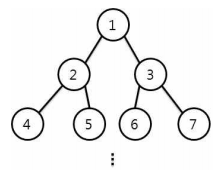

distance of nodes
====================================

다음과 같이 노드에 번호가 부여된 이진트리가 있다. 이 트리는 단말 노드를 제외 한 모든 노드들이 2개의 자식을 가지며, 모든 단말노드의 높이가 같다.      

 

 

두 노드 간의 거리는 한 노드에서 다른 노드로 이동할 때 거치는 간선의 수의 합 을 의미한다. 예를 들어 노드 5와 노드 3의 거리는 3이다.         

임의의 두 노드가 주어질 때, 두 노드 간의 거리를 구하는 프로그램을 작성하시오.           

**입력** 

첫 번째 줄에 두 노드의 번호가 공백으로 구분되어 입력된다. (단, 두 노드의 값은 1이상 2,100,000,000 이하의 값이다.)                         

**출력**  

두 노드 간의 거리를 출력한다.        

| 입력 예                      |출력 예                |
|---------------------------|---------------------|
|5 3   3 4  | 3   3                 |
