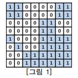
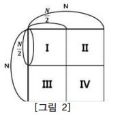
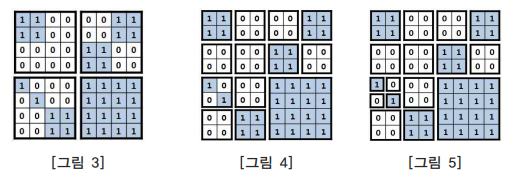

영역 구분
====================================

아래 그림과 같이 여러 개의 정사각형 칸들로 이루어진 정사각형 모양의 영역이 주어져 있고, 각 정사각형 칸들은 정올이의 땅은 흰색으로 칠해져 있고 영재의 땅은 검은색으로 칠해져 있다. 주어진 땅을 일정한 규칙에 따라 나누어 다양한 크기를 가 진 정사각형 모양의 하얀색 또는 회색 영역으로 구분하려고 한다.               

 

 

전체 영역의 크기가 n*n (n= , k는 1 이상 7 이하의 자연수) 이라면 영역을 구 분하는 규칙은 다음과 같다. 전체 영역이 모두 같은 색이 아니라면 가로와 세로로 중간 부분을 잘라서 <그림 2>의 Ⅰ, Ⅱ, Ⅲ, Ⅳ와 같이 똑같은 크기의 네 개의 n/2 * n/2 영역으로 나눈다.
나누어진 영역 Ⅰ, Ⅱ, Ⅲ, Ⅳ 각각에 대해서도 앞에서와 마찬가지로 모두 같은 색 으로 이루어지지 않으면 같은 방법으로 똑같은 크기의 네 개의 영역으로 나눈다. 이 와 같은 과정을 구분되어진 영역이 모두 하얀색 또는 모두 회색으로 되거나, 하나의 정사각형 칸이 되어 더 이상 나눌 수 없을 때까지 반복한다.                      

 

 

위와 같은 규칙에 따라 나누었을 때 [그림 3]은 [그림 1]의 영역을 처음 나눈 후의 상태를, [그림 4]는 두 번째 나눈 후의 상태를, [그림 5]는 최종적으로 만들어진 다양 한 크기의 9개의 하얀색 영역과 7개의 회색영역을 보여주고 있다.           

 

 

입력으로 주어진 영역의 한 변의 길이 n과 각 정사각형 칸의 색 (하얀색 또는 회 색)이 주어질 때 잘라진 하얀색 영역과 회색 영역의 개수를 구하는 프로그램을 작성 하시오.          

**입력** 

입력 파일의 첫째 줄에는 전체 영역의 한 변의 길이 n이 주어져 있다. n은 2, 4, 8, 16, 32, 64, 128 중 하나이다. 영역의 각 가로줄의 정사각형 칸들의 색이 윗 줄부터 차례로 입력 파일의 둘째 줄부터 마지막 줄까지 주어진다. 회색으로 칠해진 칸은 0, 하얀색으로 칠해진 칸은 1로 주어지며 각 숫자 사이에는 빈칸이 하나씩 있다.                                       

**출력**  

첫째 줄에는 잘라진 하얀색 영역의 수를 출력하고 둘째 줄 에는 회색 영역의 수를 출력한다.        

| 입력 예                      |출력 예                |
|---------------------------|---------------------|
|8   1 1 0 0 0 0 1 1   1 1 0 0 0 0 1 1   0 0 0 0 1 1 0 0   0 0 0 0 1 1 0 0   1 0 0 0 1 1 1 1   0 1 0 0 1 1 1 1   0 0 1 1 1 1 1 1   0 0 1 1 1 1 1   | 9   7                 |
