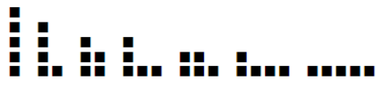

Partitioned
====================================

같은 크기의 정사각형 종이가 n장 있다. 
이 종이들을 밑변을 평행하게 연결하여 몇 개를 나열했다. 맨 아래에 나열한 변의 길이는 바로 윗 변의 길이보다 같거나 길어야 한다. 
예를 들어 n=5일 경우는 다음과 같은 방법으로 배치가 가능하다.               

 

 

위 그림을 숫자로 다음과 같이 표현할 수 있다.
(5) (4,1) (3,2) (3,1,1) (2,2,1) (2,1,1,1) (1,1,1,1,1)
n이 입력될 때 가능한 배치를 모두 구하시오. 단 숫자형태로 표현했을 때, 사전순 으로 내림차순으로 한 줄에 하나씩 출력하시오.                

**입력** 

하나의 정수 n이 입력된다. (단 n은 30미만의 값이다.)                                     

**출력**  

숫자형태로 한 줄에 하나씩 내림차순으로 공백으로 구분하여 출력한다.       

| 입력 예                      |출력 예                |
|---------------------------|---------------------|
| 5    | 5    4 1   3 2   3 1 1   2 2 1   2 1 1 1   1 1 1 1 1      |