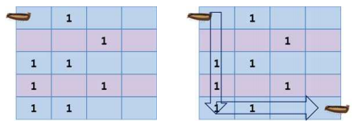

광석 수집 (Collecting ore)
====================================

GT혹성에 광석을 수집하는 SCV는 항상 오른쪽이나 아래쪽으로만 진행된다. 이때 SCV가 수집하는 최대 광석의 개수를 출력하자. 최대 n*m으로 이루어진 광석을 캐는 지역이 입력되고 항상 시작은 1,1에서 시작하여 n, m에서 종료된다.              

 

 

위의 그림에서 SCV는 1,1에서 출발하여 그림처럼 광석을 수집하면 최대 4개가 가 능하다.                

**입력** 

입력으로 광석의 최대 세로크기(1<=n<=200)와 가로크기(1<=m<=200)가 입력된다.

다음 n줄에 걸쳐 m열만큼 공백으로 구분하여 광석이 표시된다. 이때 1이 광석을 표현한다.                                    

**출력**  

SCV가 수집하는 최대 광석의 개수를 출력하라.      

| 입력 예                      |출력 예                |
|---------------------------|---------------------|
| 5 4   0 1 0 0   0 0 1 0   1 1 0 0   1 0 1 0    1 1 0 0    | 4     |