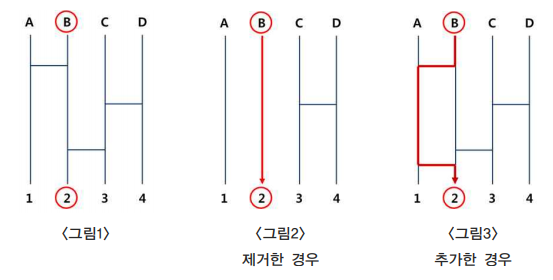

잭과 콩나물
====================================

최근의 극장가에 ‘잭 더 자이언트 킬러’가 상영되었다. 이 영화 속 ‘클로이스트’의 시골 농장에서 삼촌과 함께 살고 있는 잭은 시장에 말을 팔러 갔다가 돈 대신 콩 몇 알을 얻게 된다. 그날 밤 잭의 집으로 세찬 비바람을 피해 낯선 손님 이자벨이 찾아 온다. 그리고 우연히 잭이 낮에 얻어온 콩이 물에 젖어 하늘로 뻗어 오르면서 이야 기가 시작된다. 

이 영화를 본 E교수는 학생들에게 콩나물을 연결하는 문제를 제시하였다. 세로 형 태의 콩나물이 n개가 있고, 세로 콩나물 사이에 가로 형태의 콩나물 m개가 설치되 어 있다. 세로 형태의 콩나물은 제일 왼쪽부터 번호가 1, 2, ..., n이고, 가로 형태의 콩나물은 제일 위에서부터 번호가 1, 2, ..., m이다. 같은 높이에 위치한 가로 콩나물은 없다.

 

 

<그림1>과 같은 경우 n=4, m=3인 콩나물들이다. A는 3으로, B는 1로, C는 4로, D 는 2로 가게 된다. 이는 사다리게임과 동일하다. 우리는 이 콩나물들을 조작해서 우리가 원하는 모양으로 만들고자 한다

콩나물을 조작할 때에는 가로 형태의 콩나물만 제거하거나 추가할 수 있다. 콩나 물 하나를 제거할 때 X만큼의 비용이 들고 추가할 때 Y만큼의 비용이 필요하다. 예 를 들어 <그림1>의 경우 B에서 2로 가고자 한다면 <그림2>처럼 A-B 사이에 연결 된 콩나물과 B-C 사이에 연결된 콩나물을 제거하거나 <그림3>처럼 B-C 사이에 연 결된 콩나물 밑에 A-B 사이에 연결하는 콩나물을 추가하면 된다.

만약, 제거하는 비용이 1이고, 추가하는 비용이 5라면 <그림2>처럼 2개를 제거한 경우에는 2의 비용이 들고 <그림3>처럼 1개를 추가할 경우에는 5의 비용이 든다. 그러므로 최소 비용은 2가 된다. 위와 같이 출발점 a 위치에서 아래의 도착점 b 위 치로 갈 수 있도록 조작할 때 필요한 최소 비용을 구하는 프로그램을 작성하시오.

**입력** 

1. 첫째 줄에 n, m이 주어진다. (단, 1≦n≦100, 1≦m≦500)

2. 둘째 줄에는 a, b, X, Y가 주어진다(단, 0≦X≦1000, 0≦Y≦1000).

3. 셋째 줄부터 m +2줄까지는 위에서부터 가로 콩나물에 대한 정보를 나타내는 정수 p가 주어진다. p의 의미는 p번과 p +1번의 세로 콩나물을 연결하는 가로 콩나물을 의미한다.

**출력**  

첫 줄에 최소 비용을 출력한다.     

| 입력 예                    |      출력 예                |
|---------------------------|-----------------------------|
| 4 3   2 2 1 5   1   3   2 | 2                        |

