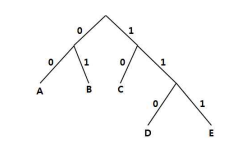

허프만 인코딩
====================================

허프만 인코딩은 탁월한 글자 압축 알고리즘이다. 이 알고리즘은 1952년 Davide Huffman에 의해 개발되었다.

기본 아이디어는 각 문자를 2진 순서를 이용해서 자주 등장하는 글자에게 비트를 작게 할당하고 아주 드문 글자에게 많은 비트를 할당하여 줄이는 방식이다. 그리고 모든 글자의 2진 순서는 다르다. 

보통 이진트리형태로 표현하여 글자를 단말노드(트 리의 마지막에 배치하는 형태이다. 예를 들어 아래의 그림과 같은 이진트리에 각 문 자가 배치되었다고 하면

 

 

A 는 00, B는 01, C는 10, D는 110, E는 111로 코드를 갖게 된다. 이를 바탕으로 주어진 문자를 압축을 하게 된다. 여러분들은 역으로 허프만 코드가 주어질 경우 압 축된 데이터를 원래의 문자로 변경하는 것이다. 주어진 압축 이진코드를 읽어 원래 의 문자로 출력하는 것이다.

**입력** 

첫줄에 정수 k(1<=k<=20)가 입력된다. 이것은 허프만 코드의 각 문자의 개수를 나타낸다.  

다음 줄부터 k개의 문자와 그에 상응하는 이진코드 값이 공백으로 구분하여 입력 된다. (최대 20자) 이며 문자는 A~Z, a~z 중에 선택된다. 

그 다음 줄에 250자리 이하 의 코드가 입력된다.

**출력**  

첫줄에 코드를 원래의 문자로 출력한다.    

| 입력 예                    |      출력 예                |
|---------------------------|-----------------------------|
| 5   A 00   B 01   C 10   D 110   E 111   00000101111 |    AABBE |
