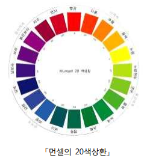

색상환
====================================

색을 표현하는 기본 요소를 이용하여 표시할 수 있는 모든 색 중에서 대표적인 색
을 고리 모양으로 연결하여 나타낸 것을 색상환이라고 한다. 미국의 화가 먼셀
(Munsell)이 교육용으로 고안한 20색상환이 널리 알려져 있다. 아래 그림은 먼셀의
20색상환을 보여준다.

 

 

색상환에서 인접한 두 색은 비슷하여 언뜻 보면 구별하기 어렵다. 위 그림의 20색
상환에서 다홍은 빨강과 인접하고 또 주황과도 인접하다. 풀색은 연두, 녹색과 인접
하다. 시각적 대비 효과를 얻기 위하여 인접한 두 색을 동시에 사용하지 않기로 한다.

주어진 색상환에서 시각적 대비 효과를 얻기 위하여 서로 이웃하지 않은 색들을
선택하는 경우의 수를 생각해 보자. 

먼셀의 20색상환에서 시각적 대비 효과를 얻을 수 있게 10개의 색을 선택하는 경
우의 수는 2이지만, 시각적 대비 효과를 얻을 수 있게 11개 이상의 색을 선택할 수
없으므로 이 경우의 수는 0이다.

주어진 정수 n과 k에 대하여, n개의 색으로 구성되어 있는 색상환(n색상환)에서 어
떤 인접한 두 색도 동시에 선택하지 않으면서 서로 다른 k개의 색을 선택하는 경우
의 수를 구하는 프로그램을 작성하시오. 

**입력** 

입력 파일의 첫째 줄에 색상환에 포함된 색의 개수를 나타내는 양의 정수 n이 주
어지고, 둘째 줄에 n색상환에서 선택할 색의 개수 k가 주어진다. (4<=n<=1,000), (1<=k<=n)

**출력**  

첫째 줄에 n색상환에서 어떤 인접한 두 색도 동시에 선택하지 않고 k개의 색을 고
를 수 있는 경우의 수를 1,000,000,003 (10억 3)으로 나눈 나머지를 출력한다.    

| 입력 예                    |      출력 예                |
|---------------------------|-----------------------------|
| 4   2 | 2 |
