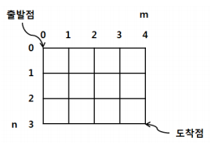
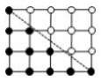
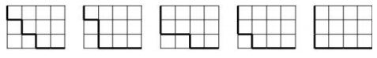

격자길(S) - [문제 20]
====================================

H*W 격자에서 왼쪽 위(0,0)에서 오른쪽 아래(H, W)까지 갈 수 있는 길의 수를 헤
아리고자 한다.

 

 

 (1) 격자 위의 선을 따라간다.  
 (2) 아래쪽 또는 오른쪽으로만 갈 수 있다.  
 (3) (0,0)과 (H, W)를 잇는 대각선보다 위쪽에 있는 점들은 통과할 수 없다.  
 (대각선에 위치하는 점은 통과할 수 있다.)

아래의 그림에서 흰점은 통과할 수 없는 점이고 검은 점은 통과할 수 있는 점이다. 

 

 

예를 들어, 3×4 격자에서 갈 수 있는 길은 다음과 같이 5가지가 있다.

 

 

**입력** 

 1. 두 개의 정수 H와 W가 입력된다.
 2. H는 격자의 세로 크기를, W는 격자의 가로 크기를 각각 나타낸다.

        [입력값의 정의역]  
        1 <= H, W <= 10

**출력**  

(0,0)에서 (H, W)까지 갈 수 있는 길의 수를 출력한다.

| 입력 예 | 출력 예     |
|---|---|
| 3 4 | 5 |