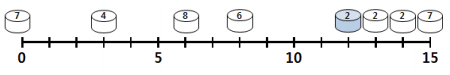

공주 구하기(L)
====================================
유시 섬에서 한가롭게 소풍을 즐기던 다리오와 오렌지 공주.

다리오가 잠시 자리를 비운 사이에 못된 악당 후퍼가 공주를 데리고 도망가 버렸
다. 다리오는 후퍼가 오렌지 공주를 숨겨놓은 후퍼 섬으로 여행을 떠난다. 

 

 

유시 섬에서 후퍼 섬까지 가기 위해서는 중간에 있는 여러 개의 섬을 거쳐 가야
한다. 유시 섬과 후퍼 섬을 포함한 모든 섬들은 유시 섬과 후퍼 섬을 지나는 직선상에 있다. 위 그림에서, 섬들을 나타내는 동그라미 아래에 있는 눈금자가 각각의 섬이유시 섬과 몇 km나 떨어져 있는지를 나타낸다.

가장 왼쪽에 있는 섬이 유시 섬이고, 가장 멀리 있는 후퍼 섬은 15km 떨어져 있
다. 한 섬에서 다른 섬으로 건너가기 위해서는 섬마다 하나씩 있는 스프링 발판을
밟아 점프해야 한다. 이 스프링 발판은 내구성이 약해서 한 번 사용하면 부서져 버린다.

이 때문에, 시작점인 유시 섬을 제외한 모든 섬들은 두 번 이상 방문하면 안 된다. 스프링 발판들의 스프링의 세기는 모두 다르다. 섬을 나타내는 동그라미에 쓰여 있는 숫자는 스프링 발판을 딛고 점프했을 때 가장 멀리 도달할 수 있는 거리를 나타낸다.

가령, 유시 섬에서 7km 떨어져 있는 섬의 스프링 발판의 세기가 3이라면, 스프링
발판을 딛고 도달할 수 있는 섬은 유시 섬에서 4km 이상 10km 이하 떨어져 있는
섬들이다. 다리오는 공주를 구하기 위해 앞만 보고 질주한다. 공주를 구하기 전에는 스프링 발판을 밟고 후퍼 섬을 향해서만 점프한다.

하지만 공주를 구한 뒤에는 공주를 들쳐 업고 유시 섬을 향해서만 뒤도 돌아보지
않고 도망친다. 일부 스프링 발판은 내구도가 너무 약해서 공주를 들쳐 업은 상태에서는 발만 딛어도 부서져버리기도 한다.

그림에서 유시 섬에서 12km 떨어진 곳에 있는 회색으로 표시된 섬의 스프링 발판
이 그 예이다. 

이런 스프링 발판들은 공주를 구하러 후퍼 섬을 향해 갈 때에만 사용할 수 있다.

유시 섬과 후퍼 섬을 포함한 모든 섬들의 정보와 섬마다 하나씩 있는 스프링 발판
의 정보가 주어질 때, 다리오가 유시 섬을 출발해 공주를 구하고 돌아오는 서로 다른 경로의 개수를 1000으로 나눈 나머지를 출력하는 프로그램을 작성하시오.

**입력** 

첫째 줄에는 섬의 개수 n이 주어진다. n은 유시 섬과 후퍼 섬도 포함한다.
 ( 3 <= n <= 20 )

이어지는 n개의 줄에는 각각의 섬에 대한 정보가 한 줄에 하나씩 주어진다. 섬의
정보는 유시 섬과의 거리가 가까운 순으로 주어진다. 그러므로 첫 번째로 정보가 주어지는 섬은 항상 유시 섬이고, 마지막으로 정보가 주어지는 섬은 항상 후퍼 섬이다.

섬의 정보를 나타내는 각각의 줄에는 섬에 대한 정보를 표현하는 세 개의 정수가
빈칸을 사이에 두고 주어진다. 첫 번째 정수 p는 유시 섬과의 거리이다. 유시 섬에 대해서는 p는 0이고, 후퍼 섬에서 p값이 가장 크다. p값이 동일한 두 섬은 존재하지 않는다.

두 번째 정수 d는 스프링 발판의 세기, 즉 해당 섬에서 좌우로 얼마나 떨어진 섬
까지 점프할 수 있는지를 나타내는 값이다. 세 번째 정수 g는 해당 섬의 스프링 발판을 오렌지 공주를 들쳐 업은 상태에서도 사용할 수 있는지를 나타내는 값이다.

1이면 오렌지 공주와 함께 이용할 수 있고, 0이면 이용할 수 없다. 후퍼 섬에서 이 값은 항상 1이다.

**출력**  

첫째 줄에 유시 섬에서 출발해 오렌지 공주를 구해오는 총 경로의 수를 1,000으로
나눈 나머지를 출력한다.

| 입력 예 | 출력 예     |
|---|---|
| 8   0 7 1   3 4 1   6 8 1   8 6 1   12 2 0   13 2 1   14 2 1   15 7 1 | 6 |