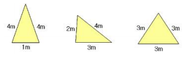

삼각화단 만들기 (Create a Triangle)
====================================

주어진 화단 둘레의 길이를 이용하여 삼각형 모양의 화단을 만들려고 한다.   
이 때 만들어진 삼각형 화단 둘레의 길이는 반드시 주어진 화단 둘레의 길이와 같아야 한
다.   
또한, 화단 둘레의 길이와 각 변의 길이는 자연수이다.    
예를 들어, 만들고자 하는 화단 둘레의 길이가 9m라고 하면,

 • 한 변의 길이가 1m, 두 변의 길이가 4m인 화단   
 • 한 변의 길이가 2m, 다른 변의 길이가 3m, 나머지 변의 길이가 4m인 화단   
 • 세 변의 길이가 모두 3m인 3가지 경우의 화단을 만들 수 있다.   

 

 

**입력** 

화단의 길이 n이 주어진다.(단, 1 <= n <= 100)

**출력**  

출력내용은 입력받은 n으로 만들 수 있는 서로 다른 화단의 수를 출력한다

| 입력 예 | 출력 예     |
|---|---|
| 9 | 3 |