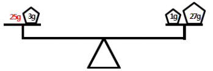

저울 추(S) - [문제 19]
====================================

평형저울을 이용하여 1kg 이하의 물건의 무게를 재려고 한다. 준비되어 있는 추는  
1g, 3g, 9g, 27g, 81g, 243g, 729g과 같이 7개의 추뿐이다.

평형저울의 양쪽 접시에 물건과 추를 적절히 놓음으로써 물건의 무게를 잴 수 있  
는데, 예를 들어, 25g의 물건을 재기 위해서는 다음과 같이 저울에 올려놓으면 된다.

 

 

물건의 무게가 입력되었을 때 양쪽의 접시에 어떤 추들을 올려놓아야 평형을 이루  
는지를 결정하는 프로그램을 작성하시오.

**입력** 

 1. 물건의 무게를 나타내는 하나의 정수 n이 입력된다(1≤n≤1,000).
 2. n은 물건의 무게가 몇 그램인지를 나타낸다.

**출력**  

 1. 저울의 왼쪽 접시와 오른쪽 접시에 올린 추를 0으로 구분하여 출력한다.
 2. 각 접시에 올린 추들을 무게가 가벼운 추부터 하나의 공백으로 구분하여 출력
한다.
 3. 물건의 무게를 왼쪽 접시의 처음에 표시한다.

| 입력 예 | 출력 예     |
|---|---|
| 25 | 25 3 0 1 27 |
| 40 | 40 0 1 3 9 27 |