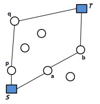

경비행기(S) - [문제 25]
====================================
경비행기 독수리호가 출발지 S에서 목적지 T로 가능한 빠른 속도로 안전하게 이동
하고자 한다. 이 때, 경비행기의 연료통의 크기를 정하는 것이 중요한 문제가 된다.

큰 연료통을 장착하면 중간에 내려서 급유를 받는 횟수가 적은 장점이 있지만 연
료통의 무게로 인하여 속도가 느려지고, 안정성에도 문제가 있을 수 있다.

한편 작은 연료통을 장착하면 비행기의 속도가 빨라지는 장점이 있지만 중간에 내
려서 급유를 받아야 하는 횟수가 많아지는 단점이 있다.

문제는 중간에 내려서 급유를 받는 횟수가 k 이하일 때 연료통의 최소 용량을 구
하는 것이다. 아래 예를 보자.

 

 

위 그림은 S, T와 7개의 중간 비행장의 위치를 나타내고 있다. 위 예제에서 중간급유를 위한 착륙 허용 최대횟수 k = 2라면, S-a-b-T로 가는 항로가 S-p-q-T로 가는항로보다 연료통이 작게 된다.

왜냐하면, S-p-q-T 항로에서 q-T의 길이가 매우 길어서 이 구간을 위해서는 상당
히 큰 연료통이 필요하기 때문이다.

문제는 이와 같이 중간에 최대 k번 내려서 갈 수 있을 때 최소 연료통의 크기가
얼마인지를 결정하여 출력하는 것이다.

참고사항은 다음과 같다. 

1) 모든 비행기는 두 지점 사이를 반드시 직선으로 날아간다. 거리의 단위는 km이며 연료의 단위는 ℓ(리터)이다. 1ℓ당 비행거리는 10km이고 연료 주입은 ℓ 단위로 한다.

2) 두 위치 간의 거리는 평면상의 거리이다. 예를 들면, 두 점 g = (2, 1)와 h = (37,43) 간의 거리 d(g, h)는 sqrt{ (2-37)^2 + (1-43)^2 }= 54.671이고 50 < d(g, h)≤ 60이므로 필요한 연료는 6ℓ가 된다.

3) 출발지 S의 좌표는 항상 (0, 0)이고 목적지 T의 좌표는 (10000,10000)으로 모든입력 데이터에서 고정되어 있다.

4) 출발지와 목적지를 제외한 비행장의 수 n은 3 <= n <= 10이고 그 좌표값 (x, y)의 범위는 0 < x, y < 10,000인 정수이다. 그리고 0 <= k <= 1000이다.

**입력** 

입력의 첫 줄에는 n과 k가 하나의 공백을 두고 주어진다. 그 다음 n개의 줄에는
각 비행장(급유지)의 정수좌표가 "x y"의 형식으로 주어진다.

**출력**  

출력에는 S에서 T까지 k번 이하로 중간급유를 하여 갈 수 있는 항로에서의 최소
연료통 용량에 해당하는 정수를 출력한다.

| 입력 예 | 출력 예     |
|---|---|
| 10 1   10 1000   20 1000   30 1000   40 1000  5000 5000   1000 60   1000 70   1000 80   1000 90   7000 7000 | 708 |